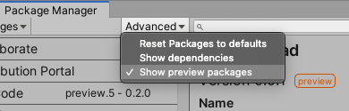
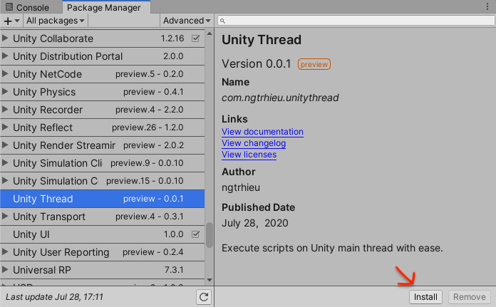

# Unity Threading makes simple

## Overview:

UnityThread is an utility script that allow you to register tasks to be run on the next Update/LateUpdate/FixedUpdate loop, from any thread.

## Getting Started:

### 1. Install (via Unity Package Manager)

Open your `Packages/manifest.json` file and add the `npm` as the registry, with the scope _"com.ngtrhieu"_ as followed:

```JSON
{
  "dependencies": {
    <...your existing dependencies>
  },
  "scopedRegistries": [
    <...other registries, if any>,
    {
      "name": "npm",
      "url": "https://registry.npmjs.org/",
      "scopes": ["com.ngtrhieu"]
    }
  ]
}
```

Open Unity, go to Package Manager (_Windows/Package Manager_)

Inside Package Manager, select _Advanced/Show Preview Packages_  


Find Unity Thread package and click _Install_.  


### 2. Usage

You will need to call `CreateUnityThreadInstance()` before accessing any UnityThread API.

```C#
using UnityEngine;
UnityThread.CreateUnityThreadInstance();
```

Schedule your code to be executed on the next Update/FixedUpdate/LateUpdate loop simply by doing:

```C#
using UnityEngine;

UnityThread.ExecuteInUpdate(() => {
  // this code will be executed on the next Update.
});

UnityThread.ExecuteInLateUpdate(() => {
  // this code will be executed on the next LateUpdate.
});

UnityThread.ExecuteInFixedUpdate(() => {
  // this code will be executed on the next FixedUpdate.
});

// This coroutine will be executed on the next Update loop.
UnityThread.ExecuteCoroutine(ACoroutine());
```

## Tests

Open `Packages/manifest.json` and add the following item:

```JSON
{
  "dependencies": {
    <...your existing dependencies>
  },
  "testables": [
    <...your existing packages, if any>
    "com.ngtrhieu.unitythread"
  ]
}
```

Open Unity Test Runner (_Window/General/Test Runner_). UnityThread tests should be shown under _PlayMode_ tests.

## Contributions

All discussions/pull requests are welcome.

## Credits

This code has been circulated and adopted among my team so I couldn't remember where we originally took this from. The earliest resemblance I can find is in [this StackOverflow](https://stackoverflow.com/a/41333540/2393202), so I would like to give credits to this answer.
